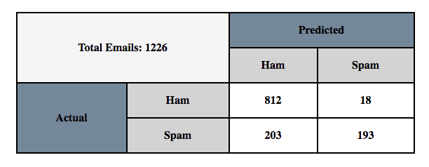
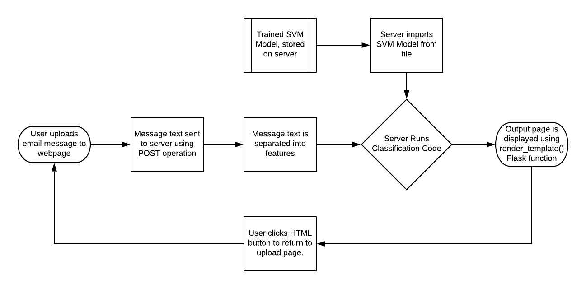

# Spam Analysis with Spamalot

:warning: This is in review 

:warning: the OpenAPI spec and service seems incomplete

:warning: I want a more in-depth discussion of the algorithm you discuss
margins, distrubutions, hyper-planes but don't really tell me what or how these
things are calculated. In this case we can get into the weeds of the path, I
don't need a derivation but equations can be helpful.

:wave: math in text can be shown with ^ and _ for super and power scripts by
putting in between money signs $ $.

:question: How do we cite equations? :smiley: You can seed them just like a
table. Give me the equation and I can showcase.

:question: I put a question mark by our equations below. They are formatted as
Latex equations, I think.


| Eric Bower, Tyler Zhang
| epbower@iu.edu, tjzhang@iu.edu
| Indiana University Bloomington
| hid: sp19-222-101
| github: [:cloud:](https://github.com/cloudmesh-community/sp19-222-101/blob/master/project-report/report.md)
| code: [:cloud:](https://github.com/cloudmesh-community/sp19-222-101/tree/master/project-code)

---

Keywords: Spam

---


## Abstract

Summarize the question, purpose of the project. 

## Introduction

The goal is the creation of a service that can classify spam emails. By the term
"spam email", we refer to emails that are sent with malicious intent against the
recipient. Emails without malicious intent will be referred to as a "ham email".
Common forms of malicious intent that steal or restrict a user's personal data
include phishing and malware.

Phishing describes a process in which an attacker impersonates a trustworthy
third party in an attempt to obtain sensitive information
[@jagatic2007social]. In a recent phishing attack, a link was sent to Snapchat
users telling them to enable two-step authentication. This link collected the
login information of more than 50,000 Snapchat users. Users were under the
impression that they were making their private information more secure, but they
instead exposed their personal information to hackers, demonstrating how
phishing can be particularly difficult to detect.

Spam emails can also have dangerous attachments that contain malware. When these
attachments are downloaded, the malware is unloaded onto the computer system as
well. A common example of malware is called ransomware, which encrypts local
files and network files, effectively preventing the user from accessing their
own files. Then, the ransomware will ask the user to pay in exchange to decrypt
their file. Even if the user pays to decrypt their data, the attacker often
still has control over the user's data and may lead to potential identity theft
[@bridges2008changing].

Classifying emails can prevent users from being affected by phishing scams and
malware. We will use a machine learning algorithm to classify malicious
emails. An important consideration for the user is to minimize misclassification
of spam emails. In other words, we need to be careful to minimize the number of
spam emails that are erroneously labeled as ham, and minimize the number of ham
emails that are erroneously labeled as spam. The consequence of
misclassification is important emails being flagged as malicious and dangerous
emails being flagged as benign. This would make it even more confusing to the
user to determine the legitimacy of their received emails.

## The Algorithm

### Naive Bayes

We considered the Naive Bayes and Support Vector Machine (SVM) algorithms for
our implementation of spam classification. Naive Bayes classifiers are typically
used for spam filtering and document classification problems
[@khorsi2007overview]. The Naive Bayes algorithm relies on Bayes' probability
theorem, which expresses a relationship between the probability of the
occurrence of an event $c$ given the occurrence of other events, $x_1$ through
$x_n$ [@zhang2004optimality]. Representing $E$ as $(x_1, x_2, ... x_n)$, the
probability of an event $c$ given $E$ is:

$$P(c|E)=\frac{P(E|c)P(c)}{P(E)}$$

In terms of classification, the vector $E$ would be the features of the data
point, and $c$ is the classification of that data point (either ham or spam). To
create a binary classifier, with two classifications being $c=spam$ and $c=ham$,
the classification of a data point with a feature vector $E$ is represented as
the following equation for $f_b(E)$:

$$f_b(E)=\frac{P(c=spam|E)}{P(c=ham|E)}>=1$$

:question: How do we cite equations? The previous two equations come from
[@zhang2004optimality].

where the $P(c=spam|E)$ and $P(c=ham|E)$ are both calculated using equation (1).
The Naive Bayes classification model has previously demonstrated excellent
precision and recall values when classifying spam emails. The following
@fig:nb_example_results shows the results of such an experiment of a Naive Bayes
classifier run on a data set of 2893 total messages:

![NB Ling-Spam Results[@androutsopoulos2000evaluation]](images/NB_LS_Results.png){#fig:nb_example_results}

It should be mentioned that recall and precision are both standard metrics used
to evaluate the effectiveness of a model. Recall is defined as the number of
true positives divided by the sum of true positives and false negatives. In
other words, to put that definition in context of the previous experiment,
recall measures the ratio of spam emails correctly identified as spam compared
to the number of actual spam emails in the data set. Precision is defined as the
number of true positives divided by the sum of true positives and false
positives. In other words, to put that definition in context of the previous
experiment, precision measures the ratio of spam emails correctly identified as
spam compared to the number of emails the classifier thinks are spam. For both
metrics, higher percentages show a superior model, and the previous figure
demonstrates decently high percentages for recall and precision when using Naive
Bayes as a spam email classifier.

:heavy_check_mark: I read the formulas to calculate dependencies and how that
affects the effectiveness of Naive Bayes...definitely over my head, I am not
able to discuss them accurately. Instead I will just mention the formulas for
Naive Bayes and how it has been successful in previous spam filter
implementations.

### Support Vector Machines (SVM)

SVM is also used to work in text classification [@khorsi2007overview]. SVM
models construct hyper-planes in the feature space of the dataset which can be
used for classification. The hyper-plane is chosen by finding the optimal plane
that maximizes its margins of separation between points of all classes
[@gunn1998support]. In other words, data points are separated from the others
based on their features in an optimal manner.

To better illustrate how SVM works, one can imagine all points of a data set
plotted based on their attributes. The data points that belong to a certain
classification will generally be plotted together into regions due to having
similar attributes. A hyper-plane is an imaginary divider between these
classification regions that is mathematically calculated based on distance. The
following figure @fig:svm_2D_example shows a visualization of a two-dimensional
hyperplane:

![SVM 2D Visualization[@gunn1998support]](images/SVM_2D_example.png){#fig:svm_2D_example}

The figure shows a divider between general regions of points classified as blue
and points classified as red. Notice that the hyper-plane is imperfect; there
are some red points on the blue side of the hyper-plane, and there are some blue
points on the red side. Error is inevitable, but it can be minimized
mathematically. To make a classification on a new piece of data, the algorithm
plots the attributes of a new point and makes a prediction based on which side
of the hyper-plane the point falls on.

SVM algorithms are very effective classifiers when working with datasets that
utilize a large number of features [@gunn1998support]. In the case of emails, we
can calculate the frequency of words contained in the email, which will be a
vector with a large number of features [@khorsi2007overview]. As a result, SVM
is an appropriate model to classify spam emails due to the high dimensional
dataset.

:wave: how would you describe a hyperplane to your aunt or uncle? include that 
description here.

Naive Bayes and SVM are both supervised learning algorithms, which means that
they are trained with data that is already labeled. Both algorithms have
strengths and weaknesses. The Naive Bayes algorithm gives optimal solutions when
dependencies distribute evenly [@zhang2004optimality]. SVM is much slower than
Naive Bayes, but typically tend to be more statistically robust
[@sculley2007relaxed]. We experimented with both algorithms and chose which one
to use based on their performance and respective statistics.

## The Data Set

The data set used to train the machine learning algorithm is taken from a
project that tested the effectiveness of five different variations of Naive
Bayesian classifiers on classifying spam emails. It contains the text of ham and
spam messages from a member of Enron corpus with random ham-spam ratio
[@metsis2006spam]. These emails are all labeled as ham or spam.

The raw messages of each email generally contain too much information to be
considered useful to train the classifier. In particular, raw email message text
has many characters that contribute little to the classification of the
email. To counteract this, we removed all non-alphabetical characters from the
from the data set. Also, we removed any words that were only one character long,
such as 'a' and 'I'. Finally, we removed all instances of the word 'the', which
turned out to be one of the most common words in all the training emails.

Additionally, previous research has shown the usefulness of lemmatization in
spam filtering [@androutsopoulos2000evaluation], which is the process of
grouping together variations of the same root word. For instance, a lemmatizer
would group all instances of the words "include", "includes", and "included" in
the same category. The data set that we used to train our algorithm was already
lemmatized, so we did not need to go through this process ourselves.

Once the email texts were filtered, we then created vectors of word frequencies
from each email. These are treated as the features for the machine learning
model. As previously mentioned, our dataset was already labeled as "spam" or
"ham", making it possible to train the SVM and Naive Bayes supervised learning
models. We shuffled the list of word frequency vectors from the dataset and
randomly chose 80% of these vectors to train both the SVM and Naive Bayes
models. We used the remaining 20% of these vectors to assess the quality of each
model.

## Model Results

The confusion matrix generated from the Naive Bayes algorithm is represented in
@fig:nb-conf-mat.

{#fig:nb-conf-mat}

The confusion matrix generated from the SVM algorithm is represented in 
@fig:svm-conf-mat.

{#fig:svm-conf-mat}

Although the Naive Bayes method correctly identified more ham as ham, it also
mislabeled more spam as ham. For the user, this would translate to more
malicious emails being allowed to pass through the filter without being flagged,
which is dangerous. On the other hand, the SVM method correctly identified more
spam as spam. However, it also mislabeled more ham as spam. For the user, this
translates to more benign emails being flagged as spam. Overall, the SVM method
would be considered safer, because it would expose less harmful emails to the
user, at the cost of incorrectly flagging ham emails more often. For this
reason, we decided to use the SVM model for our classification method.

## Implementation

### The Server

We used Swagger OpenAPI to create our server. This package lets us conveniently
define our server's endpoints and REST API operations in a concise YAML file. In
addition to Swagger OpenAPI, we also greatly utilized the Flask package. In our
YAML file, our server has one endpoint called 'upload', which acts as a REST
POST operation. The 'upload' function corresponding to this endpoint is defined
in a file called gatherData.py. It uses Flask.request() to read in a user's text
file. Once the file has been accepted, the text file is processed and the
classification occurs. The results of the classification are then returned and
displayed to the user as an HTML page using Flask.render_template(). The upload
function and the classification process is explained in more detail in the next
section.

It should be noted that the upload endpoint cannot be reached directly by URL;
it can only be accessed by pressing a JavaScript button on the home page of the
server, which then calls the Flask.request() function and starts the
classification process. If a user attempts to access the upload endpoint via URL
instead of clicking the button, they will be taken to an error page. Once a user
successfully sees the classification results, they are given the option to
return to the home page via another JavaScript button, where they can upload
another email for classification.

We created a Dockerfile that contains all the necessary files needed to host the
server. Running the server in a container such as Docker is beneficial because
installation will not interfere with the host system, and the container is easy
to remove once installed.

The following diagram @fig:classification-workflow shows the basic workflow of
our server:

{#fig:classification-workflow}

### The Upload Function and Classification

The majority of the computation of our service occurs from the function called
upload. This function takes a file from the user as an input and classifies it
as either spam or ham. The file is retrieved by utilizing the request function
in the Flask package. This file must have a .txt extension and must contain the
body of the email to be classified.

Once the file is uploaded, a function called extract_features is applied to the
file. The extract_features function converts the email text into a word
frequency vector. This feature vector is then used as an input for the SVM model
to classify the email as spam or ham.

Our server contains a previously-trained SVM model file, so it will not need to
retrain the model each time a user uploads a new file. Initially, we used
sklearn to train an SVM model on a large number of emails, creating a large
database of word frequency vectors and their corresponding
classifications. Using the pickle package, we saved this model as a file on the
server. Upon calling the upload function and successfully creating a feature
vector for the user's uploaded email, the server uses pickle to load the saved
model and predicts whether the user's email is ham or spam.

The final piece of information that the upload function calculates is a
performance statistics for the SVM model, including accuracy, precision,
sensitivity, recall, and F1 score. This gives the user insight on the
performance of the SVM model. Once the server has made a prediction and has
performance statistics, it uses the render_template function from the Flask
package to display an HTML file with the returned variables. This is what the
user finally sees after uploading their email file.

## Specification

```
swagger: "2.0"
info: 
  version: "0.0.1"
  title: "spamInfo"
  description: "An intelligent system to determine whether a given email is spam or not"
  termsOfService: "http://swagger.io/terms/"
  contact: 
    name: "Spamalot"
  license: 
    name: "Apache"
host: "localhost:8080"
basePath: "/"
schemes: 
  - "http"
consumes: 
  - "application/json"
produces: 
  - "text/html"
paths: 
  /upload:
    post:
      operationId: py_scripts.gatherData.upload
      description: "Uploads a file"
      responses:
        "201":
          description: "Upload"  
```
